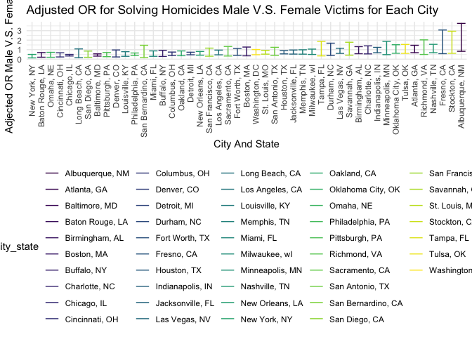
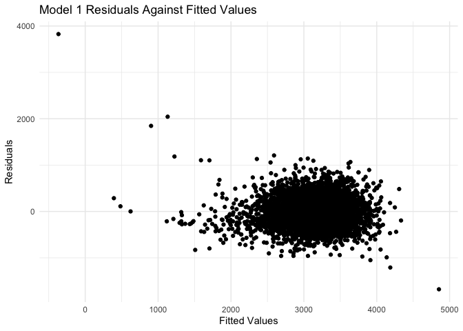
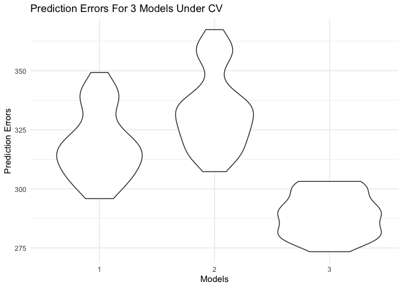

p8105_hw6_ys3637
================
Youlan Shen
2022-12-03

## Set up

``` r
# library all packages that we need at the beginning
library(tidyverse)
```

    ## ── Attaching packages ─────────────────────────────────────── tidyverse 1.3.2 ──
    ## ✔ ggplot2 3.3.6      ✔ purrr   0.3.4 
    ## ✔ tibble  3.1.8      ✔ dplyr   1.0.10
    ## ✔ tidyr   1.2.0      ✔ stringr 1.4.1 
    ## ✔ readr   2.1.2      ✔ forcats 0.5.2 
    ## ── Conflicts ────────────────────────────────────────── tidyverse_conflicts() ──
    ## ✖ dplyr::filter() masks stats::filter()
    ## ✖ dplyr::lag()    masks stats::lag()

``` r
library(modelr)
library(mgcv)
```

    ## Loading required package: nlme
    ## 
    ## Attaching package: 'nlme'
    ## 
    ## The following object is masked from 'package:dplyr':
    ## 
    ##     collapse
    ## 
    ## This is mgcv 1.8-41. For overview type 'help("mgcv-package")'.

``` r
set.seed(1)

# default set up
theme_set(theme_minimal() + theme(legend.position = "bottom"))

options(
  ggplot2.continuous.colour = "viridis",
  ggplot2.continuous.fill = "viridis"
)

scale_colour_discrete = scale_colour_viridis_d
scale_fill_discrete = scale_fill_viridis_d
```

## Problem 2

First loads, tidies, and clean the data.

Create a city_state variable, omit 4 cities, and limit race to White and
Black

``` r
# read in data from CSV file
homicide_data <- read_csv("Data/homicide-data.csv")
```

    ## Rows: 52179 Columns: 12
    ## ── Column specification ────────────────────────────────────────────────────────
    ## Delimiter: ","
    ## chr (9): uid, victim_last, victim_first, victim_race, victim_age, victim_sex...
    ## dbl (3): reported_date, lat, lon
    ## 
    ## ℹ Use `spec()` to retrieve the full column specification for this data.
    ## ℹ Specify the column types or set `show_col_types = FALSE` to quiet this message.

``` r
# show the first several lines of the original data
homicide_data
```

    ## # A tibble: 52,179 × 12
    ##    uid   repor…¹ victi…² victi…³ victi…⁴ victi…⁵ victi…⁶ city  state   lat   lon
    ##    <chr>   <dbl> <chr>   <chr>   <chr>   <chr>   <chr>   <chr> <chr> <dbl> <dbl>
    ##  1 Alb-…  2.01e7 GARCIA  JUAN    Hispan… 78      Male    Albu… NM     35.1 -107.
    ##  2 Alb-…  2.01e7 MONTOYA CAMERON Hispan… 17      Male    Albu… NM     35.1 -107.
    ##  3 Alb-…  2.01e7 SATTER… VIVIANA White   15      Female  Albu… NM     35.1 -107.
    ##  4 Alb-…  2.01e7 MENDIO… CARLOS  Hispan… 32      Male    Albu… NM     35.1 -107.
    ##  5 Alb-…  2.01e7 MULA    VIVIAN  White   72      Female  Albu… NM     35.1 -107.
    ##  6 Alb-…  2.01e7 BOOK    GERALD… White   91      Female  Albu… NM     35.2 -107.
    ##  7 Alb-…  2.01e7 MALDON… DAVID   Hispan… 52      Male    Albu… NM     35.1 -107.
    ##  8 Alb-…  2.01e7 MALDON… CONNIE  Hispan… 52      Female  Albu… NM     35.1 -107.
    ##  9 Alb-…  2.01e7 MARTIN… GUSTAVO White   56      Male    Albu… NM     35.1 -107.
    ## 10 Alb-…  2.01e7 HERRERA ISRAEL  Hispan… 43      Male    Albu… NM     35.1 -107.
    ## # … with 52,169 more rows, 1 more variable: disposition <chr>, and abbreviated
    ## #   variable names ¹​reported_date, ²​victim_last, ³​victim_first, ⁴​victim_race,
    ## #   ⁵​victim_age, ⁶​victim_sex

``` r
# Create a city_state variable, omit 4 cities, and limit race to White and Black
homicide_data <- homicide_data %>% 
  janitor::clean_names() %>% 
  mutate(city_state = str_c(city, ", ", state),
         victim_age = as.numeric(victim_age)) %>% 
  filter(!city_state %in% c("Dallas, TX", "Phoenix, AZ", "Kansas City, MO", "Tulsa, AL")) %>% 
  filter(victim_race %in% c("White","Black"))
```

    ## Warning in mask$eval_all_mutate(quo): NAs introduced by coercion

``` r
# show the first several lines of the cleaned data
homicide_data
```

    ## # A tibble: 39,693 × 13
    ##    uid   repor…¹ victi…² victi…³ victi…⁴ victi…⁵ victi…⁶ city  state   lat   lon
    ##    <chr>   <dbl> <chr>   <chr>   <chr>     <dbl> <chr>   <chr> <chr> <dbl> <dbl>
    ##  1 Alb-…  2.01e7 SATTER… VIVIANA White        15 Female  Albu… NM     35.1 -107.
    ##  2 Alb-…  2.01e7 MULA    VIVIAN  White        72 Female  Albu… NM     35.1 -107.
    ##  3 Alb-…  2.01e7 BOOK    GERALD… White        91 Female  Albu… NM     35.2 -107.
    ##  4 Alb-…  2.01e7 MARTIN… GUSTAVO White        56 Male    Albu… NM     35.1 -107.
    ##  5 Alb-…  2.01e7 LUJAN   KEVIN   White        NA Male    Albu… NM     35.1 -107.
    ##  6 Alb-…  2.01e7 GRAY    STEFAN… White        43 Female  Albu… NM     35.1 -107.
    ##  7 Alb-…  2.01e7 DAVID   LARRY   White        52 Male    Albu… NM     NA     NA 
    ##  8 Alb-…  2.01e7 BRITO   ELIZAB… White        22 Female  Albu… NM     35.1 -107.
    ##  9 Alb-…  2.01e7 KING    TEVION  Black        15 Male    Albu… NM     35.1 -107.
    ## 10 Alb-…  2.01e7 BOYKIN  CEDRIC  Black        25 Male    Albu… NM     35.1 -107.
    ## # … with 39,683 more rows, 2 more variables: disposition <chr>,
    ## #   city_state <chr>, and abbreviated variable names ¹​reported_date,
    ## #   ²​victim_last, ³​victim_first, ⁴​victim_race, ⁵​victim_age, ⁶​victim_sex

For the city of Baltimore, MD, to fit a logistic regression on resolved
and unresolved as the outcome, and victim age, sex and race as
predictors.

First we mutate the disposition to a binary outcome and select
predictors.

``` r
# first mutate the disposition column and save the dataframe
baltimore_data <- 
  homicide_data %>% 
  filter(city_state == "Baltimore, MD") %>% 
  mutate(
    resolved = as.numeric(disposition == "Closed by arrest")) %>% 
  select(resolved, victim_age, victim_sex, victim_race)
```

Using the baltimore_data, we fit a logistic regression on resolved. Then
obtain the estimate and confidence interval of the adjusted odds ratio
for solving homicides comparing male victims to female victims keeping
all other variables fixed.

``` r
# fit a logistic regression model on baltimore data
baltimore_glm <- 
  baltimore_data %>% 
  glm(resolved ~ victim_age + victim_sex + victim_race , data = ., family = binomial())
# obtain the estimate and CI for adjusted OR comparing male victims to female victims
baltimore_glm %>% 
  broom::tidy() %>% 
  mutate(adjusted_OR = exp(estimate),
         CI_OR_Lower = exp(confint(baltimore_glm, level = 0.95))[,1],
         CI_OR_Upper = exp(confint(baltimore_glm, level = 0.95))[,2]) %>%
  select(term, estimate, adjusted_OR, CI_OR_Lower, CI_OR_Upper) %>% 
  filter(term == "victim_sexMale") %>% 
  knitr::kable(digits = 3)
```

    ## Waiting for profiling to be done...
    ## Waiting for profiling to be done...

| term           | estimate | adjusted_OR | CI_OR_Lower | CI_OR_Upper |
|:---------------|---------:|------------:|------------:|------------:|
| victim_sexMale |   -0.854 |       0.426 |       0.324 |       0.558 |

Then, run glm for each of the cities in your dataset, and extract the
adjusted odds ratio (and CI) for solving homicides comparing male
victims to female victims.

``` r
# first mutate the disposition column and save the dataframe for the whole 
# dataset
homicide_data_glm <- 
  homicide_data %>% 
  mutate(
    resolved = as.numeric(disposition == "Closed by arrest")) %>% 
  select(city_state, resolved, victim_age, victim_sex, victim_race)
# apply the glm to each city
glm_each_city <- homicide_data_glm %>% 
  nest(data = -city_state) %>% 
  mutate(glm_models = map(data, ~glm(resolved ~ victim_age + victim_sex + victim_race, data = ., family = binomial())),
         results = map(glm_models, broom::tidy)) %>% 
    select(city_state, results) %>% 
    unnest(cols = results) %>% 
    mutate(adjusted_OR = exp(estimate),
         CI_OR_Lower = exp(estimate - 1.96 * std.error),
         CI_OR_Upper = exp(estimate + 1.96 * std.error)) %>%
  select(city_state, term, estimate, adjusted_OR, CI_OR_Lower, CI_OR_Upper) %>%
  filter(term == "victim_sexMale")
# Show the result
glm_each_city  %>% 
  knitr::kable(digits = 3)
```

| city_state         | term           | estimate | adjusted_OR | CI_OR_Lower | CI_OR_Upper |
|:-------------------|:---------------|---------:|------------:|------------:|------------:|
| Albuquerque, NM    | victim_sexMale |    0.570 |       1.767 |       0.831 |       3.761 |
| Atlanta, GA        | victim_sexMale |    0.000 |       1.000 |       0.684 |       1.463 |
| Baltimore, MD      | victim_sexMale |   -0.854 |       0.426 |       0.325 |       0.558 |
| Baton Rouge, LA    | victim_sexMale |   -0.964 |       0.381 |       0.209 |       0.695 |
| Birmingham, AL     | victim_sexMale |   -0.139 |       0.870 |       0.574 |       1.318 |
| Boston, MA         | victim_sexMale |   -0.395 |       0.674 |       0.356 |       1.276 |
| Buffalo, NY        | victim_sexMale |   -0.653 |       0.521 |       0.290 |       0.935 |
| Charlotte, NC      | victim_sexMale |   -0.123 |       0.884 |       0.557 |       1.403 |
| Chicago, IL        | victim_sexMale |   -0.891 |       0.410 |       0.336 |       0.501 |
| Cincinnati, OH     | victim_sexMale |   -0.917 |       0.400 |       0.236 |       0.677 |
| Columbus, OH       | victim_sexMale |   -0.630 |       0.532 |       0.378 |       0.750 |
| Denver, CO         | victim_sexMale |   -0.736 |       0.479 |       0.236 |       0.971 |
| Detroit, MI        | victim_sexMale |   -0.541 |       0.582 |       0.462 |       0.734 |
| Durham, NC         | victim_sexMale |   -0.208 |       0.812 |       0.392 |       1.683 |
| Fort Worth, TX     | victim_sexMale |   -0.402 |       0.669 |       0.397 |       1.127 |
| Fresno, CA         | victim_sexMale |    0.289 |       1.335 |       0.580 |       3.071 |
| Houston, TX        | victim_sexMale |   -0.341 |       0.711 |       0.558 |       0.907 |
| Indianapolis, IN   | victim_sexMale |   -0.085 |       0.919 |       0.679 |       1.242 |
| Jacksonville, FL   | victim_sexMale |   -0.329 |       0.720 |       0.537 |       0.966 |
| Las Vegas, NV      | victim_sexMale |   -0.178 |       0.837 |       0.608 |       1.154 |
| Long Beach, CA     | victim_sexMale |   -0.891 |       0.410 |       0.156 |       1.082 |
| Los Angeles, CA    | victim_sexMale |   -0.413 |       0.662 |       0.458 |       0.956 |
| Louisville, KY     | victim_sexMale |   -0.712 |       0.491 |       0.305 |       0.790 |
| Memphis, TN        | victim_sexMale |   -0.324 |       0.723 |       0.529 |       0.988 |
| Miami, FL          | victim_sexMale |   -0.663 |       0.515 |       0.304 |       0.872 |
| Milwaukee, wI      | victim_sexMale |   -0.319 |       0.727 |       0.499 |       1.060 |
| Minneapolis, MN    | victim_sexMale |   -0.054 |       0.947 |       0.478 |       1.875 |
| Nashville, TN      | victim_sexMale |    0.034 |       1.034 |       0.685 |       1.562 |
| New Orleans, LA    | victim_sexMale |   -0.536 |       0.585 |       0.422 |       0.811 |
| New York, NY       | victim_sexMale |   -1.338 |       0.262 |       0.138 |       0.499 |
| Oakland, CA        | victim_sexMale |   -0.574 |       0.563 |       0.365 |       0.868 |
| Oklahoma City, OK  | victim_sexMale |   -0.026 |       0.974 |       0.624 |       1.520 |
| Omaha, NE          | victim_sexMale |   -0.961 |       0.382 |       0.203 |       0.721 |
| Philadelphia, PA   | victim_sexMale |   -0.701 |       0.496 |       0.378 |       0.652 |
| Pittsburgh, PA     | victim_sexMale |   -0.842 |       0.431 |       0.265 |       0.700 |
| Richmond, VA       | victim_sexMale |    0.006 |       1.006 |       0.498 |       2.033 |
| San Antonio, TX    | victim_sexMale |   -0.350 |       0.705 |       0.398 |       1.249 |
| Sacramento, CA     | victim_sexMale |   -0.402 |       0.669 |       0.335 |       1.337 |
| Savannah, GA       | victim_sexMale |   -0.143 |       0.867 |       0.422 |       1.780 |
| San Bernardino, CA | victim_sexMale |   -0.692 |       0.500 |       0.171 |       1.462 |
| San Diego, CA      | victim_sexMale |   -0.884 |       0.413 |       0.200 |       0.855 |
| San Francisco, CA  | victim_sexMale |   -0.498 |       0.608 |       0.317 |       1.165 |
| St. Louis, MO      | victim_sexMale |   -0.352 |       0.703 |       0.530 |       0.932 |
| Stockton, CA       | victim_sexMale |    0.301 |       1.352 |       0.621 |       2.942 |
| Tampa, FL          | victim_sexMale |   -0.214 |       0.808 |       0.348 |       1.876 |
| Tulsa, OK          | victim_sexMale |   -0.025 |       0.976 |       0.614 |       1.552 |
| Washington, DC     | victim_sexMale |   -0.371 |       0.690 |       0.468 |       1.017 |

Create a plot that shows the estimated ORs and CIs for each city.
Organize cities according to estimated OR, and comment on the plot.

``` r
glm_each_city %>% 
  ggplot(aes(x = fct_reorder(city_state, adjusted_OR, max), y = adjusted_OR, color = city_state)) + 
  geom_errorbar(aes(ymin = CI_OR_Lower, ymax = CI_OR_Upper)) +
  labs(
    title = "Adjusted OR for Solving Homicides Male V.S. Female Victims for Each City",
    x = "City And State",
    y = "Adjected OR Male V.S. Female Victimes") +
  theme(axis.text.x = element_text(angle = 90, vjust = 0.5, hjust=1))
```

<!-- -->

Form the plot, we can see that most of the adjusted ORs are lower than
1, which means in most of the cities, if the victim is male, then the
case is harder to close(the suspect will be less likely to be caught),
compared to the female victims. However, since there is also a large
proportion of cities’ OR confidence interval contains 1, we cannot
confidently conclude that the cases for male victims are harder to
close. For cities whose OR confidence intervals do not contain 1, we can
conclude that we have evidence that the cases for male victims are
harder to close than those for female victims.

## Problem 3

First load and clean the dataset.

``` r
# read in data from CSV file
birthweight_data <- read_csv("Data/birthweight.csv")
```

    ## Rows: 4342 Columns: 20
    ## ── Column specification ────────────────────────────────────────────────────────
    ## Delimiter: ","
    ## dbl (20): babysex, bhead, blength, bwt, delwt, fincome, frace, gaweeks, malf...
    ## 
    ## ℹ Use `spec()` to retrieve the full column specification for this data.
    ## ℹ Specify the column types or set `show_col_types = FALSE` to quiet this message.

``` r
# show the first several lines of the original data
birthweight_data
```

    ## # A tibble: 4,342 × 20
    ##    babysex bhead blength   bwt delwt fincome frace gaweeks malform menarche
    ##      <dbl> <dbl>   <dbl> <dbl> <dbl>   <dbl> <dbl>   <dbl>   <dbl>    <dbl>
    ##  1       2    34      51  3629   177      35     1    39.9       0       13
    ##  2       1    34      48  3062   156      65     2    25.9       0       14
    ##  3       2    36      50  3345   148      85     1    39.9       0       12
    ##  4       1    34      52  3062   157      55     1    40         0       14
    ##  5       2    34      52  3374   156       5     1    41.6       0       13
    ##  6       1    33      52  3374   129      55     1    40.7       0       12
    ##  7       2    33      46  2523   126      96     2    40.3       0       14
    ##  8       2    33      49  2778   140       5     1    37.4       0       12
    ##  9       1    36      52  3515   146      85     1    40.3       0       11
    ## 10       1    33      50  3459   169      75     2    40.7       0       12
    ## # … with 4,332 more rows, and 10 more variables: mheight <dbl>, momage <dbl>,
    ## #   mrace <dbl>, parity <dbl>, pnumlbw <dbl>, pnumsga <dbl>, ppbmi <dbl>,
    ## #   ppwt <dbl>, smoken <dbl>, wtgain <dbl>

``` r
# clean the data
birthweight_data <- birthweight_data  %>% 
  janitor::clean_names() %>%  
  mutate(babysex = ifelse(babysex == 1, "male", "female"),
         mrace = ifelse(mrace == 1, "White", ifelse(mrace == 2, "Black", ifelse(mrace == 3, "Asian", ifelse(mrace == 4, "Ruerto Rican", "Other"))))) %>%
  mutate(babysex = fct_infreq(babysex),
         mrace = fct_infreq(mrace))
# show the first several lines of the cleaned data
birthweight_data
```

    ## # A tibble: 4,342 × 20
    ##    babysex bhead blength   bwt delwt fincome frace gaweeks malform menarche
    ##    <fct>   <dbl>   <dbl> <dbl> <dbl>   <dbl> <dbl>   <dbl>   <dbl>    <dbl>
    ##  1 female     34      51  3629   177      35     1    39.9       0       13
    ##  2 male       34      48  3062   156      65     2    25.9       0       14
    ##  3 female     36      50  3345   148      85     1    39.9       0       12
    ##  4 male       34      52  3062   157      55     1    40         0       14
    ##  5 female     34      52  3374   156       5     1    41.6       0       13
    ##  6 male       33      52  3374   129      55     1    40.7       0       12
    ##  7 female     33      46  2523   126      96     2    40.3       0       14
    ##  8 female     33      49  2778   140       5     1    37.4       0       12
    ##  9 male       36      52  3515   146      85     1    40.3       0       11
    ## 10 male       33      50  3459   169      75     2    40.7       0       12
    ## # … with 4,332 more rows, and 10 more variables: mheight <dbl>, momage <dbl>,
    ## #   mrace <fct>, parity <dbl>, pnumlbw <dbl>, pnumsga <dbl>, ppbmi <dbl>,
    ## #   ppwt <dbl>, smoken <dbl>, wtgain <dbl>

``` r
# check NAs
birthweight_data %>% 
  is.na() %>% 
  colSums() %>% 
  knitr::kable(col.names = c("Counts of NA"))
```

|          | Counts of NA |
|:---------|-------------:|
| babysex  |            0 |
| bhead    |            0 |
| blength  |            0 |
| bwt      |            0 |
| delwt    |            0 |
| fincome  |            0 |
| frace    |            0 |
| gaweeks  |            0 |
| malform  |            0 |
| menarche |            0 |
| mheight  |            0 |
| momage   |            0 |
| mrace    |            0 |
| parity   |            0 |
| pnumlbw  |            0 |
| pnumsga  |            0 |
| ppbmi    |            0 |
| ppwt     |            0 |
| smoken   |            0 |
| wtgain   |            0 |

``` r
# write_csv(birthweight_data, "Data/birthweight2.csv") for check
```

There is no missing value for each column.

Propose a regression model for birthweight.

I will limit to variables that I think have lower colinearity, and are
significant, and use step function with backwards direction to generate
a model.

Model 1: bwt \~ babysex + blength + gaweeks + malform + momage + mrace +
smoken + wtgain

I exclude bhead (which I think is related to blength), delwt, fincome,
mheighth, ppbmi, ppwt (which I think is related to wtgain), frace,
menarche, parity, pnumlbw, pnumgsa (which I think is less important
here).

``` r
m <- lm(bwt ~ babysex + blength + gaweeks + malform + momage + mrace + smoken + wtgain, data = birthweight_data)
# use step function with backwards direction to generate a model
m1 <- step(m, direction = "backward", trace = FALSE)
# R^2 stats
m1 %>% broom::glance()
```

    ## # A tibble: 1 × 12
    ##   r.squared adj.r.sq…¹ sigma stati…² p.value    df  logLik    AIC    BIC devia…³
    ##       <dbl>      <dbl> <dbl>   <dbl>   <dbl> <dbl>   <dbl>  <dbl>  <dbl>   <dbl>
    ## 1     0.614      0.613  319.    766.       0     9 -31182. 62385. 62455.  4.39e8
    ## # … with 2 more variables: df.residual <int>, nobs <int>, and abbreviated
    ## #   variable names ¹​adj.r.squared, ²​statistic, ³​deviance

``` r
# estimates and p values
m1 %>%
  broom::tidy() %>%
  select(term, estimate, p.value) %>% 
  knitr::kable(
    digits = 4
  )
```

| term              |   estimate | p.value |
|:------------------|-----------:|--------:|
| (Intercept)       | -3771.2298 |  0.0000 |
| babysexfemale     |   -17.1840 |  0.0785 |
| blength           |   118.8536 |  0.0000 |
| gaweeks           |    22.6457 |  0.0000 |
| momage            |     4.1054 |  0.0024 |
| mraceBlack        |  -169.5004 |  0.0000 |
| mraceRuerto Rican |  -107.9816 |  0.0000 |
| mraceAsian        |  -138.5512 |  0.0051 |
| smoken            |    -5.9261 |  0.0000 |
| wtgain            |     5.0400 |  0.0000 |

After the step function with backwards direction, I generate a final
model with 7 variables.

-   Final Model 1: bwt \~ babysex + blength + gaweeks + momage + mrace +
    smoken + wtgain

Then, show a plot of model residuals against fitted values.

``` r
birthweight_data %>% 
  modelr::add_residuals(m1) %>% 
  modelr::add_predictions(m1)  %>% 
  ggplot(aes(x = pred, y = resid)) + 
  geom_point() +
  labs(
    title = "Model 1 Residuals Against Fitted Values",
    x = "Fitted Values",
    y = "Residuals"
  ) 
```

<!-- -->

Using crossv_mc to compare the model 1 with other two models.

-   Model 2 : bwt \~ blength + gaweeks

-   Model 3: bwt \~ bhead \* blength \* babysex

First generate the CV dataframe.

``` r
# select usable variables from the birthweight_data
birthweight <- birthweight_data %>% 
  select(bwt, babysex, bhead, blength, gaweeks, momage, mrace, smoken, wtgain)
# generate a cv dataframe at the beginning
cv_df =
  crossv_mc(birthweight, 30) %>% 
  mutate(
    train = map(train, as_tibble),
    test = map(test, as_tibble))
```

Then fit 3 models to the generated CV dataframe.

``` r
cv_df <-
  cv_df %>% 
  mutate(
    model_1  = map(train, ~lm(bwt ~ babysex + blength + gaweeks + momage + mrace + smoken + wtgain, data = .x)),
    model_2     = map(train, ~lm(bwt ~ blength + gaweeks, data = .x)),
    model_3 = map(train, ~lm(bwt ~ bhead * blength * babysex, data = .x))) %>% 
  mutate(
    rmse_1 = map2_dbl(model_1, test, ~rmse(model = .x, data = .y)),
    rmse_2    = map2_dbl(model_2, test, ~rmse(model = .x, data = .y)),
    rmse_3 = map2_dbl(model_3, test, ~rmse(model = .x, data = .y)))
```

In the end, to plot the prediction error for 3 models.

``` r
cv_df %>% 
  select(starts_with("rmse")) %>% 
  pivot_longer(
    everything(),
    names_to = "model", 
    values_to = "rmse",
    names_prefix = "rmse_") %>% 
  mutate(model = fct_inorder(model)) %>% 
  ggplot(aes(x = model, y = rmse)) + geom_violin()
```

<!-- -->

From the plot, I can conclude that regardign to prediction error, model
3 is the best, since it has the lowest RMSEs. The speads of RMSEs in
three models are different, model 1 has lower RMSE compared to model 2.
So, if we only look at the prediction error, I could conclude that the
model 3: bwt \~ bhead \* blength \* babysex is the best. In the
meantiem, model 3 does not have lots of predictors, so it is a great
model here.
